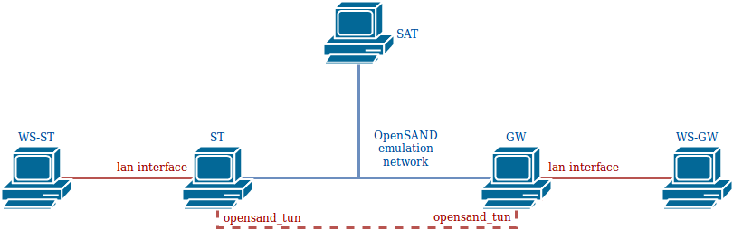
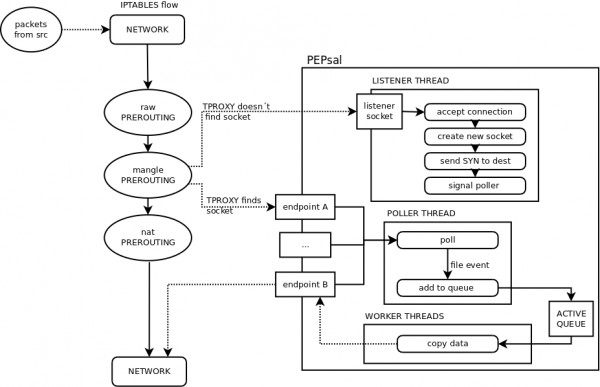

-=-=-=-=-=-=-=-=-=-=-=-=-=-=-=-=-=-=-=-=-=-=-=-=-=-=-=-=-=-=-

PEPsal: A TCP Performance Enhancing Proxy for satellite links

-=-=-=-=-=-=-=-=-=-=-=-=-=-=-=-=-=-=-=-=-=-=-=-=-=-=-=-=-=-=-

PEPsal is a Performance Enhancing Proxy (PEP), used for optimizing TCP connections on satellite links. It works at multiple layers (IP, TCP, and Application): it uses netfilter to intercept those connections that would involve a satellite links and “steals” the TCP SYN packet in the three-way handshake phase of a TCP connection, then pretends to be the other side of that connection, and initiate a new connection to the real endpoint, using a userspace application that directly copy data between the two sockets. It thus effectively splits the TCP connection in two.

PEPsal represents a valid solution for the degraded TCP performance when satellite links are involved. It does not require modifications on content servers, or satellite receivers, it is sufficient to set it up in a computer traversed by the TCP connections.
It is designed to follow the advices in [IETF RFC3135](https://datatracker.ietf.org/doc/html/rfc3135), to implement a simple TCP Split technique.

- [Installation manual](#installation-manual)
- [User manual](#user-manual)
- [OpenSAND and OpenBACH manual](#opensand-and-openbach-manual)
- [Design document](#design-document)
- [Authors and contributors](#authors-and-contributors)
- [License](#license)
- [References](#references)

# Installation manual

Deploy to see how to install PEPSal

## Requirements

### Computers

PEPsal can be installed on any number of machines. If it installed on one side of a link, the TCP connections will be accelerated only in one way. If it is installed on both ends of the link (symmetrical PEP), the TCP connections will be accelerated both ways.

### Operating System

PEPsal is distributed in debian packages compatible with Ubuntu versions 14.04 and 16.04.

For any other distribution/version, the source code is available for compilation.

## PEPsal installation

PEPsal is distributed via debian packages, stored in the Net4Sat depository.

To get these packages, add this repository to the APT sources list:

On Ubuntu 16.04 LTS or upper

> echo "deb https://raw.githubusercontent.com/CNES/net4sat-packages/master/ focal stable" | sudo tee /etc/apt/sources.list.d/raw_githubusercontent_com_CNES_net4sat_packages_master.list  

Update the apt cache after adding the new repository, and install the pepsal package:

> sudo apt-get update
> sudo apt-get install pepsal

After installation, PEPSal should be running in background as a service. 

# User manual 

Deploy to see how to use PEPSal

By default, PEPsal will be launched as a service, running the pepsal binary as a daemon.

## Parameters

PEPsal binary can be run with the following optional parameters:
- *-d* (daemon): run the binary in the background.
- *-v* (verbose): allow debug logs.
- *-h* (help): print the usage, and exit.
- *-f* (fastopen): enable using TCP FastOpen with the PEP sockets (must also be enabled at OS level).
- *-p* (port): the PEP listening port (by default, *5000*).
- *-V* (version): print version, and exit.
- *-a* (ip_address): address to bind the listening port (by default, *0.0.0.0*, all the interfaces).
- *-l* (log_file): file to log the active connections periodically.
- *-g* (gc_interval): connections garbage collector that removes no longer entries from hash tables. (by default, 15 hours)
- *-t* (pending_lifetime): maximum lifetime for a pending connection. Past this time, it will be considered garbage. (by default, 5 hours)
- *-c* (max_conns): maximum number of connections allowed (by default, 2112).

In order to configure these parameters for the PEPsal service, the file */etc/pepsal/pepsal.conf* must be modified, and the service restarted. This file contains variables for all the parameters already described.

## Iptables

Besides from running the binary, the traffic to optimize must be redirected to the PEPsal interface. This redirection is done by netfilter, and can be configured by using the tool iptables.

The target to use to redirect traffic to PEPsal is *TPROXY*, which can be used only in the *PREROUTING* chain (that treats packets before being routed) of the mangle table. This target receives two parameters: the port to which redirect the traffic (the port of PEPsal), and a mark to set to the packets. This mark will be used to route the packets.

As filter, any rule can be used: incoming interface, source address and/or port, destination address and/or port. In any case, since only TCP traffic is optimized, it is recommended to specify it to avoid unnecessary processing.

For example, to filter all incoming traffic on the interface *eth0*, the command to add this rule is:

> iptables -A PREROUTING -t mangle -p tcp -i eth0 -j TPROXY --on-port 5000 --tproxy-mark 1

To effectively direct these packets to PEPsal, they have to be routed to the local lo interface. A default route can be added for packets with a fwmark, so that the routing of other packets is not disturbed. To instruct the kernel to use a particular routing table (not the default) for marked packets, run the following command:

> ip rule add fwmark 1 lookup 100

This commands tells the kernel to use the routing table number 100, when routing packets with a forwarding mark equal to 1.

Finally, a default route must be added to this new table, telling the kernel to route all packets to the loopback interface:

> ip route add local 0.0.0.0/0 dev lo table 100

These two commands must be configured only one time, since they are valable for all PEPsal traffic. On the other hand, any number of iptables rules can be added, to filter any type of traffic. 

# OpenSAND and OpenBACH manual

## OpenSAND

Deploy to see how to use PEPSal alongside OpenSAND

Using PEPSal alongside OpenSAND requires no specific configuration in order to work. This page shows an example of a typical use-case.

The image below depicts the architecture used.

OpenSAND is installed on three machines, ST, GW and SAT. These machines are linked by the OpenSAND emulation network; when the emulation is running (on IP mode), the GW and ST are linked via a tunnel, through the interface *opensand_tun* on each of these machines. Two workstations are connected to the LAN networks of the ST and GW, and act as client and server, respectively.

In order to accelerate the traffic that passes through the OpenSAND tunnel, PEPSal must be installed on the ST and on the GW.

To capture the traffic that passes between the ST and the GW, then all the traffic that enters via *opensand_tun* and the LAN interface must be redirected toward PEPSal on each machine. The rules to add on each of the GWs and STs:

> iptables -A PREROUTING -t mangle -p tcp -i opensand_tun -j TPROXY --on-port 5000 --tproxy-mark 1

> iptables -A PREROUTING -t mangle -p tcp -i lan_interface -j TPROXY --on-port 5000 --tproxy-mark 1

where lan_interface must be replaced by the real name of the OpenSAND LAN interface on the machine. In order to route the packets to the local PEPSal socket, the following commands must also be executed:

> ip rule add fwmark 1 lookup 100

> ip route add local 0.0.0.0/0 dev lo table 100

For more information about these commands, refer to the [User manual](#user-manual).

Finally, if the GW is to be used as the network gateway by the ST (or the WS-ST), then all the traffic on OpenSAND must be redirected to the GW, and translated with NAT. To redirect all trafic via the GW on OpenSAND, with the advanced mode enabled, go to the Configuration tab, and then click on Advanced. On the Topology tab, Sarp section, set default to 0. To NAT the traffic on the GW, coming from the ST, add the following iptables rule:

> iptables -A POSTROUTING -t nat -s X.X.X.X/X_IP -o out_interface -j MASQUERADE --random

where X.X.X.X/X must be replaced by the ST LAN network address (for example, 192.168.19.0/24), and out_interface by the interface connecting the GW to the external network.

## OpenBACH

Deploy to see how to orchestrate PEPSal with OpenBACH

OpenBACH can be used to orchestrate PEPSal.

It provides running code and specific examples through the exploitation of *executors*.

Please refer to OpenBACH repository for more information. 

# Design document

Deploy to see PEPSal design document

## Network level

Incoming packets are usually handled by the kernel, and are not accessible to the user to modify. In Linux, it is possible to configure the behaviour of the packets (e.g. routing) using the framework Netfilter. Netfilter offers various tools for packet filtering, network address translation (NAT), and port translation. It also offers mechanisms for passing packets to a queue accessible from the userspace, and then returning these packets back to the kernel.

PEPsal uses netfilter in order to capture SYN segments traversing the system (e.g. being routed, but not to the host) that are establishing a new connection. The rules to perform this action are set using iptables, and are placed in the mangle table, PREROUTING chain (before the packets are routed), and the target used is a TPROXY (Transparent Proxy). The target TPROXY works as the following: the system searchs for a socket with the same destination pair (IP address and port) on the local machine. If a socket is found, that means that a transparent proxy is already established, and thus, redirects this packet to said socket. In the other hand, if no socket is found (meaning no connection was established, and that, probably, the segment is a SYN), netfilter redirects the packet to a local port, where a socket is listening for incoming connections. In this case, this port is that of PEPsal, which is listening for new connections. At such event, PEPsal 1) accepts the connection, “impersonating” the remote host, and 2), creates a new socket, bound to the original source address and port, and establishes a connection with the original destination host, splitting the TCP connection in two. All subsequent traffic corresponding to any of these two connections is affected by the same rule in iptables, and will be redirected to the corresponding sockets (since now, netfilter will be able to find one with the same destination address and port).

Besides the iptables rule, in order to locally route the packets to the PEP socket, a mark is used on all packets that match the rules added. Since the packets must not exit the machine, but be redirected to the local sockets, they must be routed to the loopback interface. In order to not interfere with the routing of all the other packets not affected by PEPsal, a different routing table than the default one is used for marked packets. Thus, the mark added by the TPROXY target (with the --tproxy-mark option) is assigned to an specific routing table. The default route for this table routes all packets to the loopback interface (refer to this section for the commands).

## Application level

At application level, an application (called pepsal), is in charge of accepting the connections on behalf of the original destination, of creating new sockets and establishing a connection with the destination, and of redirecting the traffic between the two endpoints (TCP Splitting).

PEPsal contains several threads to perform the different tasks in parallel. These threads are: the listener thread, the poller thread, and the worker threads.

### Listener thread

The listener thread is in charge of intercepting the SYN segments trying to start new connection that arrive to the listener socket (by default, bound to the port 5000 on all interfaces). First, the listener socket is opened, and then an infinite loop is entered, waiting for incoming connection requests on this socket. Once a connection request is intercepted (redirected by the TPROXY target that was unable to find a matching socket), the connection is accepted on behalf of the remote host, and a new socket is created, bound to the original source address. Immediately after, a new socket with the original source address is created, and a connection is established with the original destination. A signal is sent to the poller thread, for it to watch the events that are triggered on them. The work of the listener ends here, since all subsequent packets pertaining to these connections will not be redirected the listener port.

### Poller thread

The poller thread works with the sockets that the listener has created (both endpoints). This thread contains a list of threads that are periodically polled, looking for events that may be triggered. Each time the listener thread accepts a new connection, and creates new sockets, these are signaled to the poller thread, that adds them to the local list that is being polled. When the connections are effectively established, an event of type CONNECTED is detected, and the connections are considered as open (moment at which, buffers are created in order to temporarily store the relayed data).

Once opened, the events that can be detected are the reception of data segments, or the end of a connection. In the first case, the sockets are queued to be treated by the worker threads. In the latter case, the connection on both endpoints will be closed.

### Worker threads

The worker threads are in charge of forwarding the traffic from one endpoint of the proxy to the other. The threads are signaled by the poller when there is data ready to be relayed in at least one proxy. These proxies are placed in a queue by the poller, from which a pool of worker threads will extract them, and copy the information received on one endpoint to the other. The workers will continue to work until there are no more items in the active queue, and then will wait for a new signal by the poller.

### Timer scheduler

There exists another thread, called the timer scheduler thread, that runs periodically, checking for pending logs to be displayed on screen (or to the log file), and checking if it is time to call the garbage connections collector.

By default, the garbage connections collector is called every 15 hours, and its purpose is to search for proxies with state “PENDING”, with a syn_time greater than a specified value, i.e. connections that weren't successfully established.

# Authors and contributors

Idea and Design	: 
- Carlo Caini <ccaini@deis.unibo.it>, 
- Rosario Firrincieli <rfirrincieli@arces.unibo.it>  
- Daniele Lacamera <root@danielinux.net>

Author		: 
- Daniele Lacamera <root@danielinux.net>

Co-Author	: 
- Sergio Ammirata <sergio.ammirata@wialan.com>

CNES has proposed to maintain and make some evolutions for the satellite community alongside OpenSAND and OpenBACH, in a complementary way. 

# License 

Please Refer to [COPYING](https://gitlab.cnes.fr/openbach/pepsal/-/blob/master/COPYING) for more information on the license.

# References

- C. Caini, R. Firrincieli and D. Lacamera, “PEPsal: A Performance Enhancing Proxy for TCP Satellite Connections [Internetworking and Resource Management in Satellite Systems Series],” in IEEE Aerospace and Electronic Systems Magazine, vol. 22, no. 8, pp. B-9-B-16, Aug. 2007. URL: http://ieeexplore.ieee.org/stamp/stamp.jsp?tp=&arnumber=4301030&isnumber=4300990

- C. Caini, R. Firrincieli and D. Lacamera, “PEPsal: a Performance Enhancing Proxy designed for TCP satellite connections,” 2006 IEEE 63rd Vehicular Technology Conference, Melbourne, Vic., 2006, pp. 2607-2611. URL: http://ieeexplore.ieee.org/stamp/stamp.jsp?tp=&arnumber=1683339&isnumber=35446

- “PEPsal: A Performance Enhancing Proxy for TCP Satellite Connections [for Internetworking and Resource Management in Satellite Systems (Series)],” in IEEE Aerospace and Electronic Systems Magazine, vol. 22, no. 8, pp. B-5-B-5, Aug. 2007. URL: http://ieeexplore.ieee.org/stamp/stamp.jsp?tp=&arnumber=4301026&isnumber=4300990

